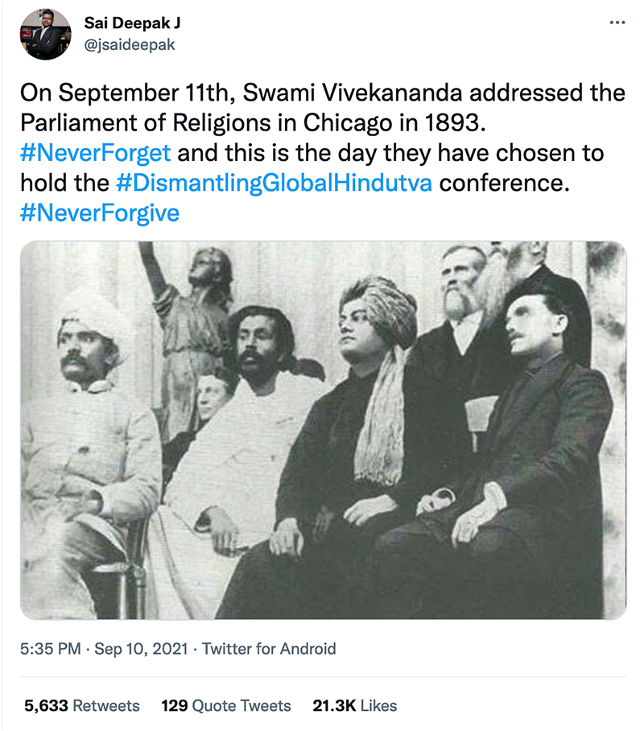
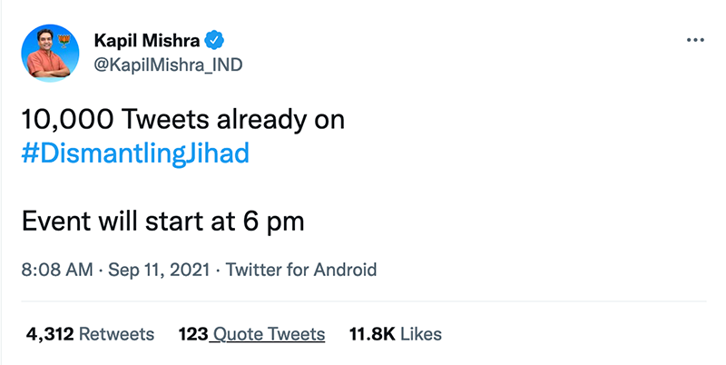
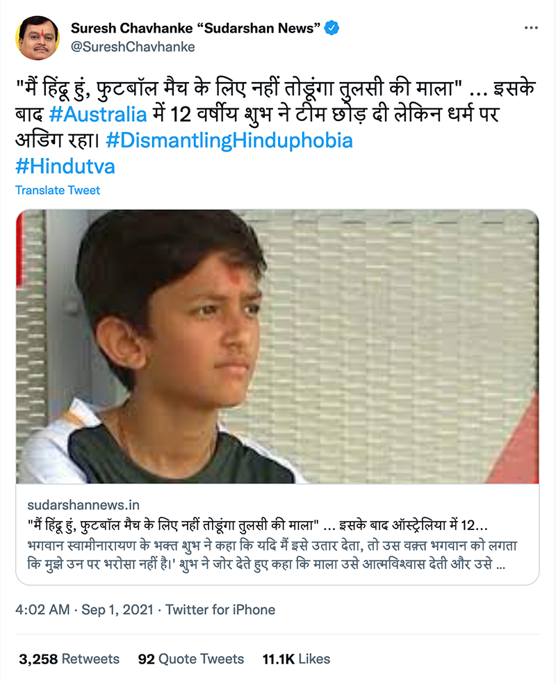
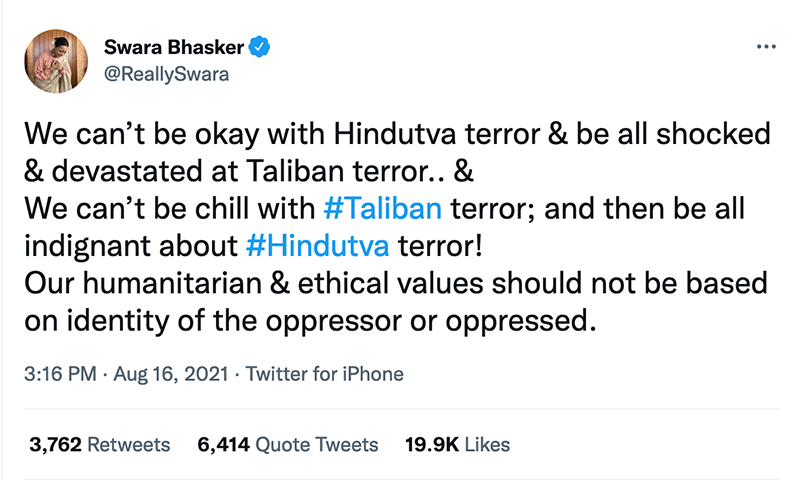
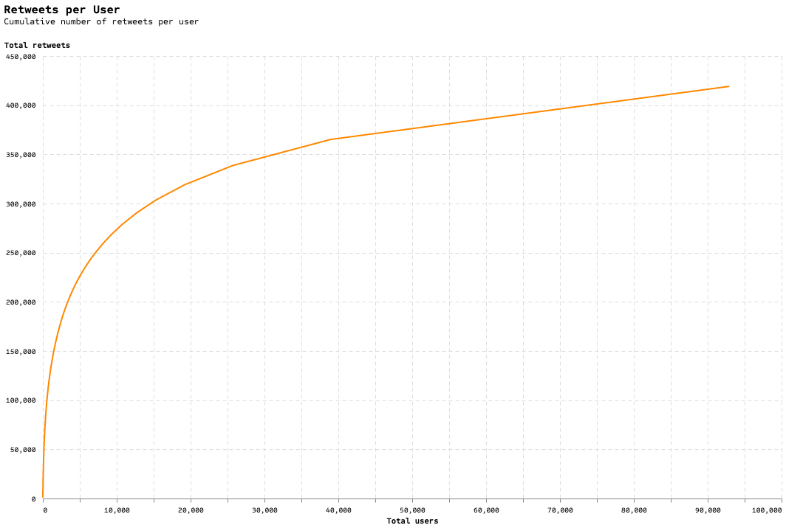
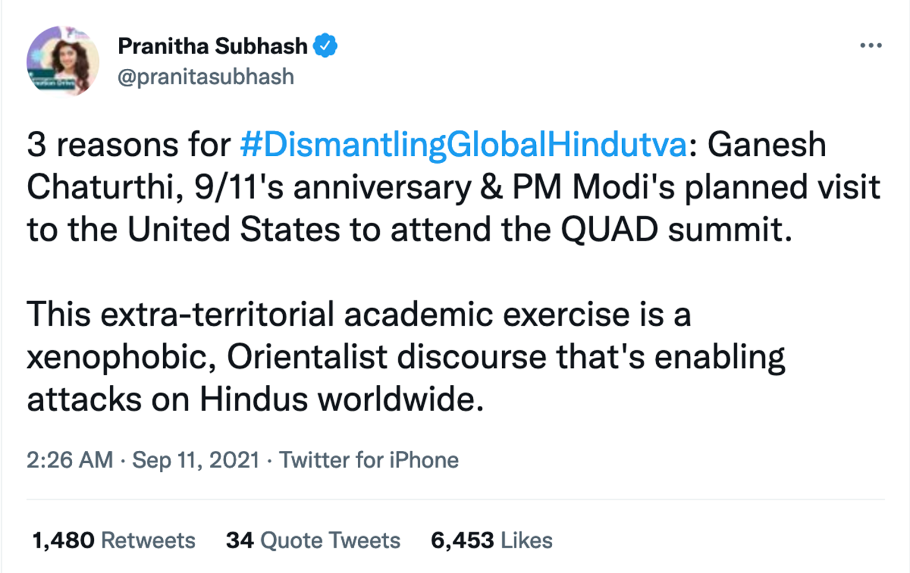
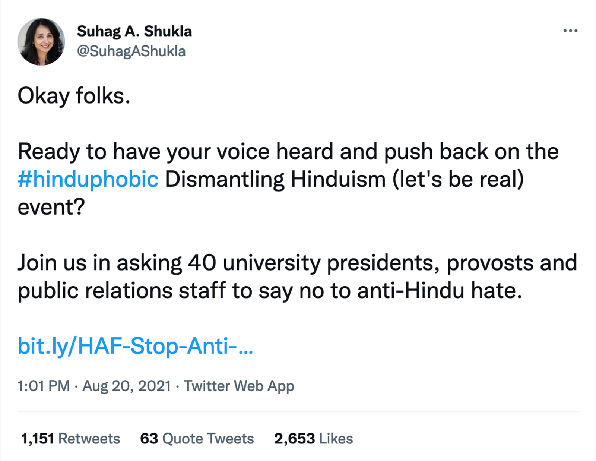
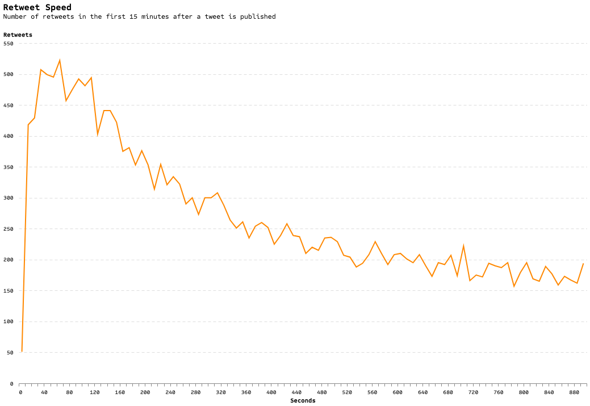

## Targeted Harassment of Academics by Hindutva : A Twitter Analysis of the India-US Connection

*Communities of "attackers" and retweeters*

By [Manan Ahmed](https://twitter.com/sepoy), [Sriharsha Devulapalli](https://twitter.com/HarshaReports), and [Juan Francisco Saldarriaga](https://juanfrans.com/)

[*We acknowledge and thank three colleagues, all of whom chose to be anonymous, for their feedback*]

### Introduction

In early September 2021 a routine academic conference was held online in North America. The conference, titled "[Dismantling Global Hindutva](https://dismantlinghindutva.com/)" was co-sponsored by a variety of faculty, student groups and academic institutions across United States. Announced in mid-August, the conference was held on September 11th and 12th with nine panels and over thirty speakers. The conference drew immediate fire from right-wing and [hindutva groups](https://www.hindutvaharassmentfieldmanual.org/defininghindutva) (twitter, tv and news)--including [death threats](https://www.theguardian.com/world/2021/sep/09/death-threats-sent-to-participants-of-us-conference-on-hindu-nationalism) to the participants. Various newspapers did independent reporting on the online abuse and harassment faced by the organizers, sponsors and participants of this academic conference. In the *Washington Post*, Niha Masih noted in her October 3, 2021 [report](https://www.washingtonpost.com/world/2021/10/03/india-us-universities-hindutva/) that "nearly a million emails were sent out in protest to universities, the event website went offline for two days after a false complaint, and an email account associated with the event was attacked with thousands of spam messages." *Al-Jazeera* also [reported](https://www.aljazeera.com/news/2021/9/7/us-academic-conference-dismantling-global-hindutva-hindu-right-wing-groups) that "US-based Hindu groups have been aggressively campaigning and pressurizing the participating universities to pull out of the conference."

Academic participants in the conference with active twitter presence—[Christophe Jaffrelot](https://twitter.com/jaffrelotc), [Gyan Prakash](https://twitter.com/Prakashzone), [Deepa Kumar](https://twitter.com/ProfessorKumar), [Manan Ahmed](https://twitter.com/sepoy), [Meena Kandasamy](https://twitter.com/meenakandasamy), [Dheepa Sundaram](https://twitter.com/themodsisyphus), to name a few—were targeted with severe online harassment. Other prominent academics such as Audrey Truschke and Ananya Chakravarti and groups such as Equality Labs (which focuses on Dalit issues) were also targeted with organized harassment. Further, the [Hindu American Foundation](https://www.hinduamerican.org/)—an US advocacy group with [ties](https://bridge.georgetown.edu/research/factsheet-rashtriya-swayamsevak-sangh-rss/) to the India-based, Hindu nationalist paramilitary organization, the Rashtriya Swayamsevak Sangh (RSS)—launched a [civil complaint](https://www.hinduamerican.org/press/university-pennsylvania-dismantling-global-hindutva-complaint) with the Department of State against University of Pennsylvania for sponsoring the conference.

This study takes a close look at the [targeted](https://www.buzzfeednews.com/article/pranavdixit/twitter-india-harassment-problem) [harassment](https://thewire.in/politics/bjp-right-wing-twitter-hindutva-trolls-hate-speech-filters-muslims) on Twitter. Our study joins several efforts to study online harassment focused on [Islamophobia](https://theconversation.com/a-twitter-investigation-reveals-what-the-freedom-convoy-islamophobes-incels-and-hindu-supremacists-have-in-common-177026), [Women](https://www.amnesty.org/en/latest/news/2018/03/online-violence-against-women-chapter-6/), [Caste](https://www.nytimes.com/2018/12/03/opinion/twitter-india-caste-trolls.html) and [academics](https://hub.jhu.edu/magazine/2019/spring/more-academics-turn-to-twitter/) in general.

The findings as detailed below upend some of our conventional thinking about online harassment. First, we see that instead of algorithmic 'bots', there is a traditional 'workforce'—coordinated most likely via WhatsApp—as detailed in this [exposé](https://thewire.in/tekfog/en/1.html) on *TekFog*. Second, there is a nexus of influence between India and the US which goes via 'verified' accounts and via social organizations. The full picture of this network is invisible on Twitter, as it likely includes channels on WhatsApp, Meta, and Instagram. Finally, there is a 'long tail' of activities that continues to tweet at accounts targeted in hate-campaigns—this certainly points to 'black lists' of targets. The fact that all of these troubling reactions happened in response to an academic conference based in scholarly inquiry highlights the grievous nature of this coordinated attack. Many academics who are encouraged to have an online platform and who work on modern South Asia do not have the capacity (or even awareness) of these coordinated campaigns.

We are three researchers based, respectively, in the [History Department](https://history.columbia.edu/), the [Journalism School](https://journalism.columbia.edu/) and the [Brown Institute for Media Innovation](https://brown.columbia.edu/) at Columbia. We hope that this brief study will open up new conversations within and outside the academy on this pernicious attack on academic freedom.

### Findings

* Most of the activity occurred on September 1, 2021 (shortly after the conference was publicly announced), during the 3 days of the Dismantling Global Hindutva conference (September 10, 11, and 12), and on September 15, 2021 ([Figure 1](#Tweets-per-day)).
* The majority of users in our dataset only authored one tweet, yet the top 1,400 users (6.6%) were responsible for more than 50% of the tweets. This points to a very active and engaged concentration of users with wide reach. ([Figure 2](#Cumulative-tweets)).
* 40% of users in our dataset were created since the beginning of 2020 ([Figure 3](#User-creation-month)).
* Even though the majority of users in our retweet dataset only retweeted one tweet the top 4,000 (4%) users were responsible for more than 50% of the retweets in our dataset ([Figure 4](#Retweets-per-user)).
* Surprisingly, bot activity was minimal: the majority of tweets were user generated by individuals, not bots. More than 90% of tweets and retweets were generated through common "sources" such as the Twitter app for iPhone, the Twitter app for Android, and the Twitter web app ([Figure 5](#Source)).
* The median time difference between attacker tweet and retweet was slightly over 3 hours. 25% of retweets happened within 50 minutes and 75% of them happened within 11 hours ([Figure 6](#Retweet-speed)).
* The network of "attacker" accounts and their retweeters is top-heavy with 'peak' influencers leading the attacks. This means that most of the retweeters only retweet one of the attackers, and they do it only once ([Figure 7](#Top-network)).

### Methodology

We began with a focus on hashtags deployed against the conference. We can already see, in the list reproduced below, several the important themes: an idea of "Hinduphobia" and claims of "racism" alongside positive assertions of "SantanDharma" or "HinduRashtra"—themselves claims of an expansive, imperial and eternal religious state. We collected data through [Twitter’s academic API](https://developer.twitter.com/en/products/twitter-api/academic-research), which gave us free access to the full historical archive of tweets. We used Python to query the API and downloaded all tweets and retweets published between August 8 and September 21, 2021 that included any of the following hashtags:

* #dgh
* #Hinduphobic
* #Brahmanism
* #dghconference
* #dgh_conf_agenda_hinduphobia
* #dgh_panelists_hindu_haters
* #HinduRashtra
* #Hindutva
* #Hindu_Rashtra
* #Hinduism
* #StopHinduphobia
* #DismantlingGlobalHindutva
* #dismantlinghinduphobia
* #dismantlingjihad
* #swamivivekananda
* #RacistRutgers
* #WakeupHindus
* #SanantanDharma
* #AudreyTruschke
* #AntiHindu
* #HindutvaIsHinduism
* #hindutvaforglobalgood
* #AntiHindutva
* #HinduHeritageMonth
* #DismantleJihad
* #SanatanDharma.

This process yielded **63,308 unique tweets** and **419,164 unique retweets**—a significantly broad dataset. Of these 63,000 tweets there were around 39,000 "original" tweets, 12,000 "replies", and 10,000 "quotes". The API also provided us data on the tweet or retweet author and, when available, geographic location. There were 23,761 unique authors of tweets and 111,324 unique authors of retweets.

These tweets, retweets, and user details make up our main corpus of research. Subsequently, we also queried the Twitter API to download all tweets (independent of hashtag) from the 100 most prolific tweet and retweet users in our corpus. Our corpus of tweets, retweets, and users was analyzed and visualized using Python along with the Pandas, Numpy, Altair and NetworkX libraries.

### Overall Patterns

#### Hashtags

The hashtag that yielded the most results was #Hindutva, followed by #Hinduism, #dgh_panelists_hindu_haters, #dismantlingjihad, and #DismantlingGlobalHindutva. These 5 hashtags accounted for more than 70% of the total tweets collected. Retweets follow a slightly different pattern. The hashtag that yielded the most results was #Hindutva, followed by #dgh_panelists_hindu_haters, #DismantlingGlobalHindutva, #dismantlingjihad, and #Hinduism. The top 5 retweet hashtags accounted for almost 75% of all retweets collected.

#### Activity over time

Most of the tweet and retweet activity for our chosen hashtags occurred on September 1, 2021, during the 3 days of the "Dismantling Global Hindutva" conference (September 10, 11, and 12), and on September 15, 2021. Retweets followed a similar pattern, with more than 80,000 retweets published on September 1st and almost 100,000 published on September 11th.

Temporarily, individual hashtags mostly follow the overall pattern of tweets and retweets, with most of them peaking on September 1st and September 10, 11 and 12.

Tweets and retweets happen all throughout the day but the bulk of them (50%) were published between 10am and 4pm Coordinated Universal Time (UTC) . Since Twitter’s API does not provide the timezone where the tweet or retweet was published, we cannot say what those times represent locally. However, these times correspond to 6am - 12pm Eastern Standard Time and 3:30pm - 9:30pm India Standard Time, the two most likely locations where tweets and retweets in our dataset are published from.

#### Users

There were 23,761 unique tweet authors in our dataset. Of these, only 1,146 (4.8%) were "verified" users. Similarly, there were 111,324 unique retweet authors. Of these, only 342 (0.3%) were "verified". Overall, only 1% of the users in our dataset are "verified".

The most prolific tweet author was [@AvicSaha_](https://twitter.com/AvickSaha_/with_replies) who published 831 tweets. Other prolific tweeters were [@Harkanwal911](https://twitter.com/Harkanwal911), [@GauravArora0409](https://twitter.com/GauravArora0409), [@ThisIsSwami](https://twitter.com/ThisIsSwami), and [@Sant_Krupa](https://twitter.com/Sant_Krupa). Together these 5 users account for less than 5% of all tweets collected. In terms of retweets, the top 5 retweeters are responsible for 0.9% of all retweets and the greatest number of retweets from a single user was 928. The top 100 tweet authors were responsible for 16.25% of tweets while the top 100 retweet authors were responsible for 9.27% of retweets.

Even though the majority of users in our dataset only authored one tweet or retweet, the top 1,400 users (6.6%) in our dataset were responsible for more than 50% of the tweets.

Our dataset includes both old and new users. However, 40% of users in our complete dataset were created since the beginning of 2020.

Even though overall tweet activity by date of user creation is quite spread out, there are still noticeable peaks in this distribution, especially in the retweets. For example, users created since the beginning of 2020 tend to retweet more than users created before that. Similarly, users created in 2013 and 2016-17 have a higher number of retweets.

#### Impact

Most tweets in our dataset (more than 50%) did not get any retweets or replies, and got one or no likes. However, a few of them have more than 100 retweets (1.2%), 100 replies (0.07%), and 100 likes (2.3%) . The most "impactful" tweets, measured by the number of retweets, replies, quotes, and likes, were the following:

1. [Kapil Mishra](http://www.twitter.com/@KapilMishra_IND), a BJP politician who came to prominence by incitng anti-Muslim violence in Delhi was a key node in promoting harassment of the conference. In this [highly engaged-tweet](https://web.archive.org/web/20220427025315/https://twitter.com/KapilMishra_IND/status/1436173144591536129), he equated support of the conference with support of terror.

2. J. Sai Deepak is a lawyer who has argued for Hindu right wing causes in the court. His [tweet](https://web.archive.org/web/20220223135825/https://twitter.com/jsaideepak/status/1436443141653950466) insinuated a link between the timing of the conference and Swami Vivekananda's speech at the Parliament of Religions in 1893—proclaiming the decline in the study of Hinduism in the United States.

3. Here is another [tweet](https://web.archive.org/web/20220128120059/https://twitter.com/KapilMishra_IND/status/1436662834109108229) from Mishra keeping a track of his campaign against the conference.

4. Suresh Chavhanke is the owner of Sudarshan TV - an extreme Hindu right wing news channel. His [tweet](https://web.archive.org/web/20210901092350/https://twitter.com/SureshChavhanke/status/1432977111237599232) in Hindi was referring to a story of a 12 year boy in Australia who was not allowed to play football for wearing a garland. Chavhanke uses this story as an example of Hinduphobia. This story has only circulated on right wing websites and not only mainstream media.

5. Swara Bhaskar's [tweet](https://web.archive.org/web/20220429145453/https://twitter.com/ReallySwara/status/1427348484986851382) was the most impactful tweet among those against Hindutva ideology. Bhaskar is an actor who is a regular target of right wing hate for her opinions. This tweet, while in support of the conference, met with tremendous hostility by Hindutva supporters.

#### Spread

The majority of users (58%) in our retweet dataset only retweeted one tweet, even though a very small subset of them (1.13%) retweeted 50 or more tweets. The 5 most prolific users retweeted more than 600 tweets and the top 4,000 (4%) users were responsible for more than 50% of the retweets in our dataset.

#### Bots

To understand the extent of bot activity in our dataset we examined the "source" of tweets and retweets, and submitted a list with the 250 most prolific tweet authors to [Botometer](https://botometer.osome.iu.edu/), which returns the likelihood that a Twitter user is actually a bot.

The "source" examination did not indicate any major bot activity in our dataset. More than 90% of tweets were generated through common "sources" such as the Twitter app for iPhone, the Twitter app for Android, and the Twitter web app. The proportion of retweets generated through those three sources was even higher.

Similarly, even though some of the top 250 users did receive high Botometer scores, this didn’t seem to be correlated to the number of tweets they authored or to the user’s date of creation.

#### Retweets of the main "attacker" accounts

Using what Twitter calls "public metrics" (count of retweets, quotes and replies), we selected the top 160 verified and unverified accounts in our dataset, and manually classified them into the following categories:

* Speakers at the DGH Conference
* Left Wing/Liberal Leaning Indian Accounts
* Left Wing/Liberal Leaning Indian Accounts associated with Opposition Parties
* Right Wing Leaning Indian Accounts (also includes right wing mouthpieces - OPIndia/Sudarshan TV)
* Right Wing Leaning Indian Accounts associated with the Ruling Party
* News Channels/News Papers
* Left/Liberal Leaning American Accounts
* Right Leaning American Accounts
* Accounts that don't fall in any other category

With these categories, we selected 121 accounts that we labeled as "attackers". These were the accounts that were tweeting against the conference and the people involved in it. Here are examples of some such tweets from India and the USA.

#### India & US Nexus

1. Vijay Gajera, a self identified Investigative Journalist, [tweeted](http://web.archive.org/web/20210905144718/https://twitter.com/vijaygajera/status/1434519414527848449) a thread claiming the conference was propaganda.

2. Actor Pranita Subash's [tweet](https://web.archive.org/web/20210911062637/https://twitter.com/pranitasubhash/status/1436576858879918080) accused the DGH conference as part of a larger plan to attack Hindus worldwide. She links the conference specifically to 9/11--as a number of media did, most prominently RepublicTV led by Arnab Goswami.

3. Kanchan Gupta is a senior advisor to the Ministry of Information and Broadcasting to the Modi Government. His [tweet](http://web.archive.org/web/20210910034459/https://twitter.com/KanchanGupta/status/1436166262938243072) amplifies a video of Suhag A. Shukla, director of Hindu American Foundation.

4. The Hindu American Foundation was the main organization tweeting against the Conference in the USA. [Tweets](http://web.archive.org/web/20220408181535/https://twitter.com/HinduAmerican/status/1433848711260643333) like these were intended to discredit the conference.

5. The largest individual amplifier of attacks against the conference in the US was Suhag A. Shukla, executive director of the Hindu American Foundation. Tweets like [this](https://web.archive.org/web/20210822162433/https://twitter.com/SuhagAShukla/status/1428764237191655435) were one among several dozens of tweets orchestrating a campaign against the conference.

We then isolated their tweets and analyzed a random sample of around 1,000 users that retweeted those tweets.

Analysis of this random sample shows that most of these users retweet much more than they tweet. However, only 12% of these accounts only have retweets, while more than 60% of them have at least one original tweet. Overall, the activity of the sample accounts was 79% retweets, 15% replies, 3% tweets and 3% quotes. This indicates that most users are probably not bots created just to retweet content. The great majority of the accounts show at least some type of engagement with the content, or original posts.

We also analyzed the time between the "attacker" tweets and the retweets of those tweets. The median retweet time difference was slightly over 3 hours. 25% of retweets happened within 50 minutes and 75% of them happened within 11 hours. Nevertheless, there is ample variation between individual accounts and even between individual tweets from the same account.

#### Network of authors and retweeters

Using the same group of "attacker" accounts, we built a network of "attack" authors and their retweeters. Overall, this network consists of 198,000 retweets spread among 121,000 author-retweeter pairs, with the great majority of pairs (78%) including only one retweet. However, the top 25,000 pairs by number of retweets hold more than 50% of the retweets in this dataset.

To better visualize and understand this network, we split it into two separate networks, one with the author-retweeter pairs that had 4 or more retweets (7% of the original network), and another with a random sample of 10,000 pairs. This way we are able to visualize and understand the network of top retweeters as well as the general network of author-retweeters.

Both networks could be classified as very sparse. The overall density of the network of top retweeters was 0.00063. This means that only 0.063% of all possible connections exist. Compare this to a highly connected network like that of the [digital humanities](https://www.tandfonline.com/doi/full/10.1080/23311983.2016.1171458) with an overall density of 0.036. This confirms our prior finding that most retweeters are only "connected" to one "attacker".

Similarly, splitting the networks into different "communities" reveals that most "attackers" were retweeted by distinct individual accounts, who were, for the most part, not retweeting any other attacker. These communities were usually headed by "attackers" with a high degree of network centrality.

Nevertheless, these communities did reveal certain clusters of interconnected retweeters. Here is one such example:

And here is another:

### Conclusions

This study demonstrates the expansive mobilization of Twitter to create an ecology of hate targeting voices which denounce hindutva and the power of a select group of verified users to shape the discourse. We see how a very small group of 'verified' influencers shape the discourse online providing crucial frameworks—in this case, linking the anniversary of 9/11 to the academic conference; mobilizing Islamophobia to counter their-claimed-"Hinduphobia." The influencer-accounts, use retweets and quote tweets to amplify the hatred of their much more limited circulation followers—which, in turn, push wider and wider the message of hate from the influencers. This spiked circle grows larger and larger as more and more accounts are targeted with denunciatory language. This reinforcement creates the 'community,' the 'crowd' which acts as hate-mob online, focusing their ire on particular scholars (in this case)—especially on women and muslims. The associations between tweeters and retweeters, even if in some aspects network density is low, shows how these events are used to consolidate community on the basis of hate and outrage.

Once constituted, the online Hindutva ecosystem has a long tail, which allows it to move across mediums—cable news, online publications, IRL events—and builds into a crescendo adding more and more events, fabricated 'outrages,' and claims of existential danger (to the majority): the "Hindu" is in danger of losing their jobs, their women, their numerical majority, their gods, etc. This ecosystem relies on projecting academia, especially US or EU based, as a vast "left" conspiracy that has spent decades hiding the 'truth' from the 'common man.' The prominent (and less than prominent) nodes in this network use events such as the "Dismantling Hindutva Conference" to build or furnish their own credentials as idealized defenders of "free speech."

Anti-Muslim violence has [intensified in India](https://www.theguardian.com/world/2022/apr/18/hatred-bigotry-and-untruth-communal-violence-grips-india) since the re-election of PM Modi. The role of social media, especially Twitter, is crucial to understanding this powerful increase in hate speech and acts against scholars, intellectuals, and activists working to protect free speech and minorities in India today. This analysis of a small academic conference forces us to clarify that what happens inside India is linked to communities based in US and vice versa. The ecosystem of influence-peddlers is not confined to BJP functionaries in India but these individuals sustain and grow their fan-base in the US via Twitter and other online publications. The language used by Hindutva to demonize their critics relies heavily on 'tried-and-trusted' tactics from Israel and from Latin America—linking 'anti-Semitism' to 'Hinduphobia' or claiming 'indigeneity' for themselves against 'foreign' Muslims.

As our data demonstrates, a select few people with high visibility have perpetuated dangerous misinformation with influence over thousands if not hundreds of thousands of people. These individuals are BJP politicians, Hindutva civil society luminaries and even academics in India who claim to be offering a corrective to 'leftist propaganda.'

There is an urgent need for journalistic and academic analysis of such harassment events and the consequences for safety of women, Muslims, and Dalits online. More pressing still, is the need to speak loudly and vociferously against these hate-influencers by all who have access to public fora—especially academics and journalists.
